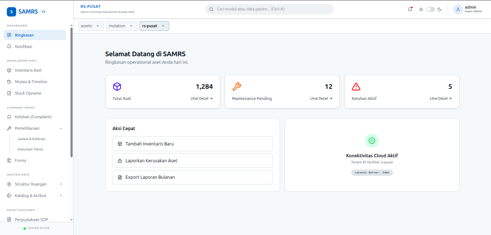

# SAMRS — Hospital Asset Management System

> A production-ready, multi-tenant SaaS platform for managing medical and non-medical assets in hospitals. Built with Go (backend) and React (frontend).

<!-- Add screenshots here once available -->
<!--  -->

## Overview

SAMRS (Sistem Aset Manajemen Rumah Sakit) covers the full asset lifecycle — from registration and location tracking to maintenance scheduling, complaint handling, and audit-compliant reporting — across multiple hospital tenants from a single deployment.

## Key Features

- **Multi-Tenant Architecture** — complete data isolation per hospital tenant
- **JWT Auth + RBAC** — role-based access control down to individual permission slugs
- **Asset Management** — CRUD, QR code generation, location mutation, event timeline
- **Stock Opname** — periodic inventory sessions with condition tracking
- **Maintenance Scheduling** — schedule, complete, and attach documents to maintenance jobs
- **Complaint / Work Order** — staff-reported issues with status tracking
- **Document Management** — upload/download SOPs, manuals, and certificates
- **Reporting** — export to CSV, XLSX, or PDF with configurable field selection
- **Audit Trail** — automatic change tracking via GORM hooks, transactional
- **Monitoring** — Prometheus metrics + Grafana dashboards

## Tech Stack

| Layer | Technology |
|---|---|
| Backend | Go, Gin, GORM, PostgreSQL 15 |
| Frontend | React 19, TypeScript, Vite, Redux Toolkit (RTK Query) |
| Routing | TanStack Router |
| UI | shadcn/ui, Tailwind CSS |
| Forms | React Hook Form + Zod |
| BFF | Node.js (Bun) |
| Auth | JWT |
| Logging | Zap (structured JSON) |
| Monitoring | Prometheus + Grafana |
| Container | Docker + Docker Compose |

## Architecture

```
samrs-project/
├── samrs-backend/          # Go REST API (Clean Architecture)
│   ├── cmd/api/            # Entrypoint
│   ├── internal/
│   │   ├── domain/         # Entities & business rules
│   │   ├── repository/     # Data access (GORM)
│   │   ├── usecase/        # Application logic
│   │   └── delivery/http/  # Handlers & middleware
│   └── pkg/                # Shared utilities
├── samrs-frontend/
│   ├── apps/frontend/      # React SPA (feature-modular)
│   └── apps/bff/           # Backend-for-Frontend (Node.js)
├── docs/                   # Architecture & API docs
├── monitoring/             # Prometheus + Grafana config
├── docker-compose.yml      # Full stack orchestration
└── Makefile                # Dev commands
```

## Quick Start

### Prerequisites
- Docker & Docker Compose

### Run with Docker

```bash
# 1. Copy and configure environment
cp .env.example .env

# 2. Start all services
make up

# 3. Seed initial data (first run)
make seed
```

Services:
| Service | URL |
|---|---|
| Frontend | http://localhost:5173 |
| Backend API | http://localhost:8080 |
| API Docs (Swagger) | http://localhost:8080/swagger |
| pgAdmin | http://localhost:8081 |
| Grafana | http://localhost:3001 |

### Run without Docker

```bash
# Backend
cd samrs-backend
cp .env.example .env   # configure DB credentials
go run cmd/api/main.go

# Frontend
cd samrs-frontend
bun install
bun run dev
```

## API Documentation

- Swagger UI: `http://localhost:8080/swagger`
- Redoc: `http://localhost:8080/swagger`
- OpenAPI spec: `dokumentasi-be/swagger.yaml`

## Running Tests

```bash
# Backend unit tests
cd samrs-backend
go test ./...

# With coverage
go test -cover ./...
```

## Documentation

| Doc | Description |
|---|---|
| [Backend Deep Dive](docs/BACKEND_DEEP_DIVE.md) | Clean architecture layers, patterns, error handling |
| [Frontend Deep Dive](docs/FRONTEND_DEEP_DIVE.md) | Module structure, state management, routing |
| [Database Schema](docs/DATABASE_SCHEMA.md) | Tables, relationships, indexing strategy |
| [Auth & RBAC](docs/AUTH_RBAC.md) | JWT flow, permission model, middleware |
| [Development Workflow](docs/DEVELOPMENT_WORKFLOW.md) | Setup, git workflow, code review checklist |

## License

MIT
